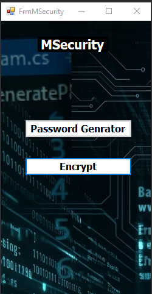
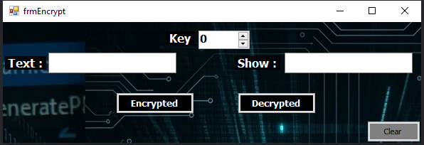
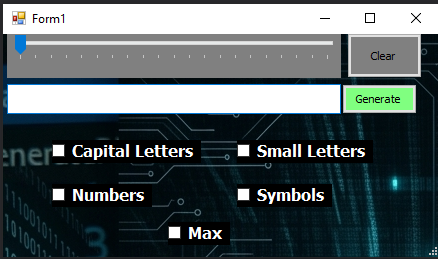

# 🛡️ MSecurity — v1.0.0

  

  <strong>Security Utility Desktop Application</strong>
   
  Generate Passwords • Encrypt • Decrypt

  
  
  

---

## 📌 Overview

**MSecurity** is a desktop application developed with **C# and Windows Forms**, bringing together password generation and text encryption/decryption in a simple interface.

The project focuses on practical implementation of user input, character selection, password generation, encryption, decryption, and Windows Forms event handling.

---

## ✨ Features

### 🔑 Password Generator

Generate passwords according to the selected options:

- 🔠 Capital Letters
- 🔡 Small Letters
- 🔢 Numbers
- 🔣 Symbols
- 📏 Password Length

### 🔐 Encryption & Decryption

- 🔒 Encrypt text using a custom key.
- 🔓 Decrypt encrypted text using the provided key.

### 🧹 Controls

- Clear generated password.
- Reset the available password-generation selections.

---

## 🖼️ Screenshots

<strong>🔒 Encryption</strong>

 

  

<strong>🔑 Password Generator</strong>

 

  

---

## 🛠️ Technology

| Technology | Usage |
|:---:|---|
| **C#** | Application development |
| **Windows Forms** | Desktop UI |
| **.NET** | Application framework |

---

## 📂 Project Structure

    MSecurity-v1.0.0/
    │
    ├── 📁 Properties/
    ├── 📁 Resources/
    ├── 📁 Screenshots/
    │   ├── 🖼️ Dashboard.png
    │   ├── 🖼️ Encrypted.png
    │   └── 🖼️ Password-Genrator.png
    │
    ├── 📄 Form1.cs
    ├── 📄 Form1.Designer.cs
    ├── 📄 Form1.resx
    │
    ├── 📄 FrmMSecurity.cs
    ├── 📄 FrmMSecurity.Designer.cs
    ├── 📄 FrmMSecurity.resx
    │
    ├── 📄 frmEncrypt.cs
    ├── 📄 frmEncrypt.Designer.cs
    ├── 📄 frmEncrypt.resx
    │
    ├── 📄 frmEncrypted.cs
    ├── 📄 frmEncrypted.Designer.cs
    ├── 📄 frmEncrypted.resx
    │
    ├── 📄 Program.cs
    ├── ⚙️ App.config
    │
    ├── 📦 GeneratePasssword.csproj
    ├── 📦 GeneratePasssword.sln
    │
    ├── 🎨 MSecurityIcon.ico
    ├── 🎨 1775822016127.ico
    │
    └── 📄 README.md

---

## 📅 Timeline

**🚀 2026/04/16**  
*Project Started*

&nbsp;&nbsp;&nbsp;&nbsp;➜&nbsp;&nbsp;&nbsp;&nbsp;

**✅ 2026/04/16**  
*Project Completed*

> ⏱️ **Development Duration:** 1 Day

---

## 📦 Release

### `v1.0.0`

**Initial Release**

---

## 👨‍💻 Author

  <strong>Mohammed Abdullah Noman Qaid Mohammed</strong>

---

  🛡️ <strong>MSecurity</strong>
   
  Generate • Encrypt • Decrypt

